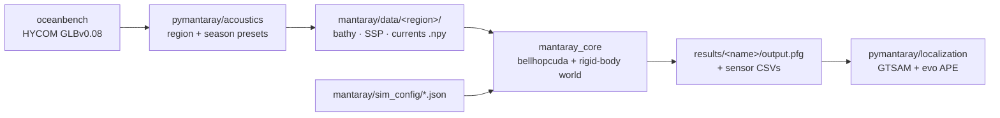

# MantaRay

*Characterizing Refraction-Induced Ranging Bias in Underwater Collaborative Localization*

[Timothy Kogucki](mailto:tkogucki4@gmail.com)<sup>1</sup>,
[Alan Papalia](mailto:apapalia@umich.edu)<sup>2</sup>

<sup>1</sup>KTH Royal Institute of Technology &nbsp;·&nbsp;
<sup>2</sup>[Robot Exploration Lab, University of Michigan](https://robotexploration.engin.umich.edu/)

[Paper (arXiv)](https://arxiv.org/abs/2609.18073) &nbsp;·&nbsp;
[Documentation](https://umich-robotexploration.github.io/manta-ray/) &nbsp;·&nbsp;
[Issues](https://github.com/UMich-RobotExploration/manta-ray/issues)

<p align="center">
  
</p>

Standard multi-agent acoustic SLAM pipelines assume straight-line
propagation for algorithmic tractability, but sound-speed variability
bends acoustic rays and systematically biases inter-agent ranges — an
effect whose impact on kilometer-scale collaborative fleets remains
unexplored. **MantaRay** is an open-source simulator that ingests HYCOM
reanalysis products and uses GPU-accelerated Bellhop (`bellhopcuda`) ray
tracing to generate refraction-informed ranges between a fleet of
Argo-style floats, then feeds them into a centralized GTSAM factor
graph. Simulated experiments over the Beaufort Sea (cold-cap halocline)
and Fram Strait (Atlantic–polar exchange) with eleven floats over seven
days and 25 Monte Carlo realizations show that acoustic refraction
systematically biases estimators as collaborative fleets scale to
operational domains spanning 5–12 km — degrading trajectories and, via
acoustic shadow zones, dropping available ranging measurements. MantaRay
is released so future environmentally-informed estimators can be
evaluated against the bias it exposes.

## Key findings

- **Opposite-sign mean bias between regions.** Fleet-wide signed range
  error `r_error = r_refracted − r_straight-line` measures **−4.92 m**
  in the Beaufort Sea and **+3.97 m** in the Fram Strait.
- **Variance is grossly under-modelled.** Empirical range-error spread
  reaches ±100 m (best-fit Gaussian σ = **35.7 m** Beaufort, **22.6 m**
  Fram) — 20–35× larger than the σ<sub>r</sub> = 1 m Gaussian noise the
  estimator assumes.
- **Environment gates ranging availability.** Ranging failure rate is
  **1.0%** in Beaufort vs **6.8%** in Fram Strait; station-keeping
  float↔diver links fail **3.6%** vs **29.5%** — a 8× regional
  difference under identical fleet and schedule.
- **Distribution shape is a regional fingerprint.** The Beaufort Sea
  carries a heavier negative tail; the Fram Strait is more symmetric.

## Repository layout

Two coupled subprojects sharing one git repo. Each has its own README.

| Subproject | Language | Role |
|---|---|---|
| [`mantaray/`](mantaray/README.md) | C++20 + CUDA | Rigid-body simulator, `bellhopcuda` ray tracing, factor-graph emission |
| [`pymantaray/acoustics/`](pymantaray/acoustics/README.md) | Python 3.12 | Pulls HYCOM data via oceanbench, writes `.npy` grids consumed by C++ |
| [`pymantaray/localization/`](pymantaray/localization/README.md) | Python 3.11 | Reads C++ `.pfg` output, runs GTSAM, plots APE via evo |

> [!IMPORTANT]
> The two Python subprojects are **independent** `uv`-managed projects
> on different Python versions and do NOT share an environment.
> Run `uv sync` from inside each subdir before using it.

## Data flow



## Quickstart

End-to-end pipeline in four stages. Each stage assumes its predecessor
has produced the artifacts it consumes.

```bash
# 1. Pull ocean data and write .npy grids  (Python 3.12)
cd pymantaray/acoustics && uv sync && uv run python oceanbench_data.py

# 2. Build the C++ simulator                (Release + CUDA)
cd ../../mantaray && cmake -S . -B cmake-build-release -DCMAKE_BUILD_TYPE=Release -G Ninja
cmake --build cmake-build-release

# 3. Run a scenario                         (must be inside cmake-build-release/src/)
cd cmake-build-release/src && ./mantaray_core ../../sim_config/beaufort_fleet_week_sim.json

# 4. Solve the resulting factor graph       (Python 3.11)
cd ../../../pymantaray/localization && uv sync && uv run python run_solver.py
```

Full build details, config schema, and per-stage usage live in the
subproject READMEs linked above.

## Reproducing the paper

Every paper figure is produced by a script in this repo. Point the
script at the pre-generated `.pfg` (or the paired-MC `.npz` cache) and
re-run; each figure lands in the results directory next to its inputs.

| Figure | Generator | Input |
|---|---|---|
| Fig. 1 — refraction diagram | Manually authored (Inkscape) | — |
| Fig. 2A — ray-trace panel | `mantaray_core` (dry-run flag) | `sim_config/beaufort_fleet_week_sim.json` |
| Fig. 2B — factor graph | [`plot_factor_graph_3d`](pymantaray/localization/debug_factor_graph_ranges.py) | `output.pfg` |
| Fig. 3 — system diagram | Manually authored (Inkscape) | — |
| Fig. 4 — SSP comparison | [`plot_ssp_comparison.py`](pymantaray/acoustics/plot_ssp_comparison.py) | `data/*/ssp.npy` |
| Fig. 5 — fleet layout | [`plot_fleet_layout.py`](pymantaray/localization/plot_fleet_layout.py) | `sim_config/beaufort_fleet_week_sim.json` |
| Fig. 6 — range bias | [`plot_range_bias_paper`](pymantaray/localization/debug_factor_graph_ranges.py) | `output.pfg` |
| Fig. 7 — pooled APE | [`plot_mc_paired_ape.py`](pymantaray/localization/plot_mc_paired_ape.py) | `mc_paired_ape.npz` |

<p align="center">
  
  
</p>

<p align="center">
  
  
</p>

## Citation

If MantaRay contributes to your work, please cite the accompanying
paper:

```bibtex
@inproceedings{kogucki2025refraction,
  title     = {Characterizing Refraction-Induced Ranging Bias in
               Underwater Collaborative Localization},
  author    = {Kogucki, Timothy and Papalia, Alan},
  booktitle = {OCEANS 2025 -- Great Lakes},
  year      = {2025},
  publisher = {IEEE},
  address   = {Chicago, IL, USA},
  note      = {\url{https://arxiv.org/abs/2609.18073}}
}
```

The GitHub "Cite this repository" button is populated from
[CITATION.cff](CITATION.cff).

## Acknowledgements

MantaRay depends on and gratefully credits:

- **HYCOM GLBv0.08** reanalysis product for the ocean environmental
  fields
- **BELLHOP** (Porter) and **bellhopcuda / bellhopcxx** (Pisha et al.) for
  ray-traced acoustic propagation
- **GTSAM** (Dellaert et al.) for the factor-graph backend
- **evo** (Grupp) for absolute pose-error evaluation
- **SciencePlots** for IEEE-quality matplotlib styling

## License

Distributed under the [MIT License](LICENSE).
