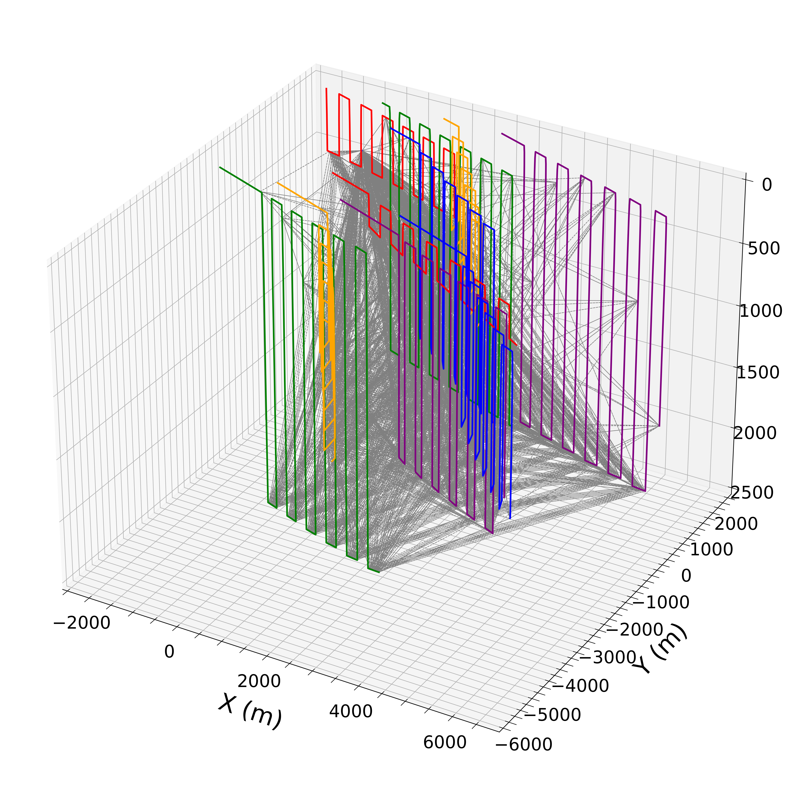
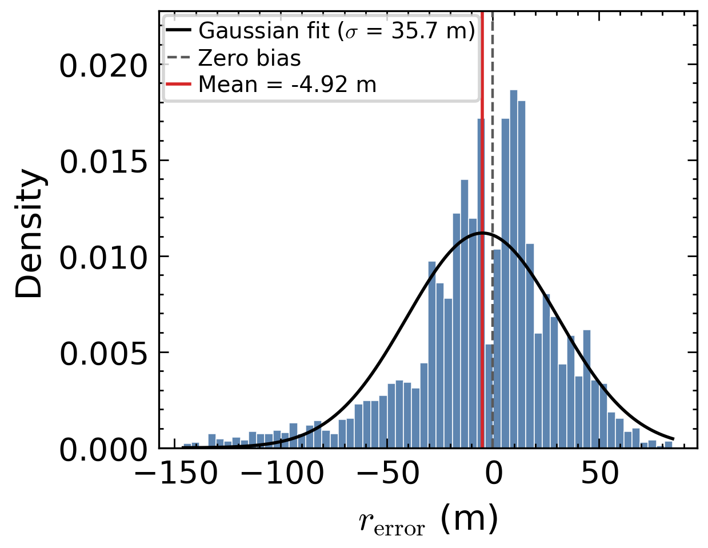
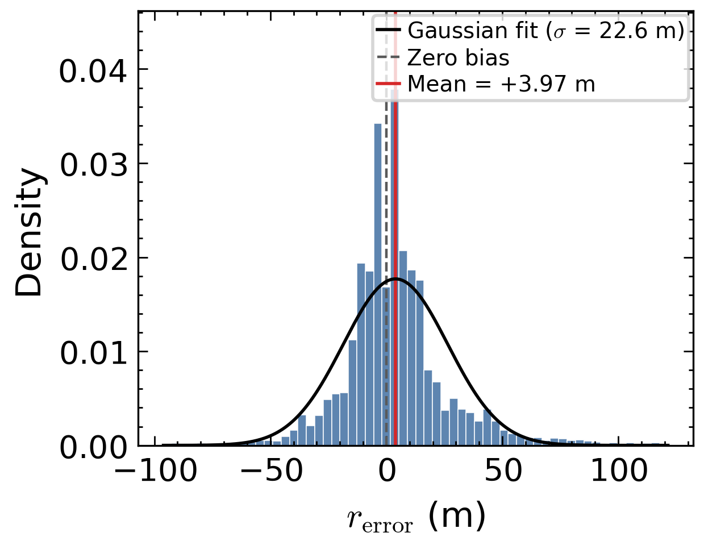
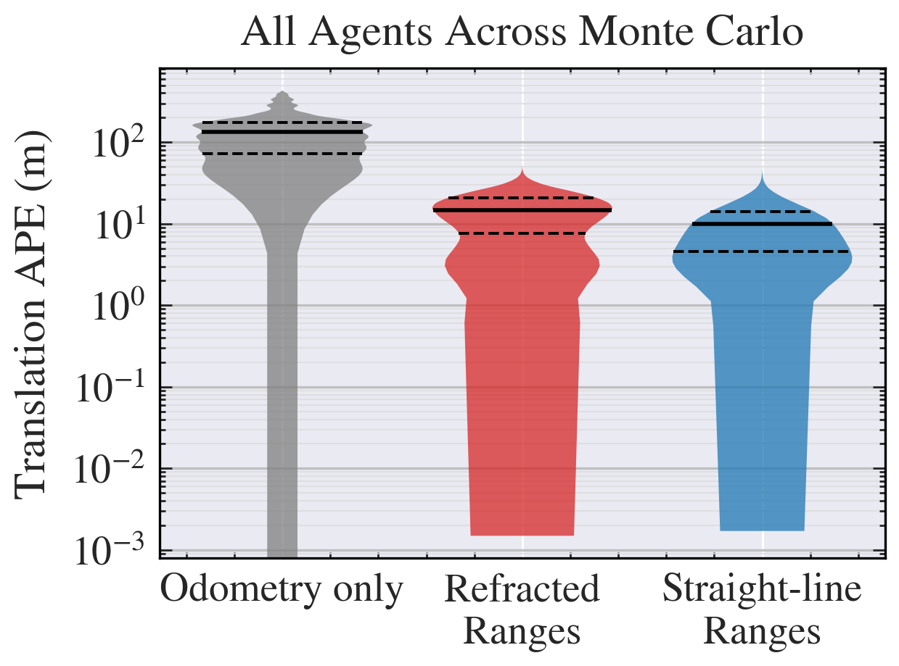
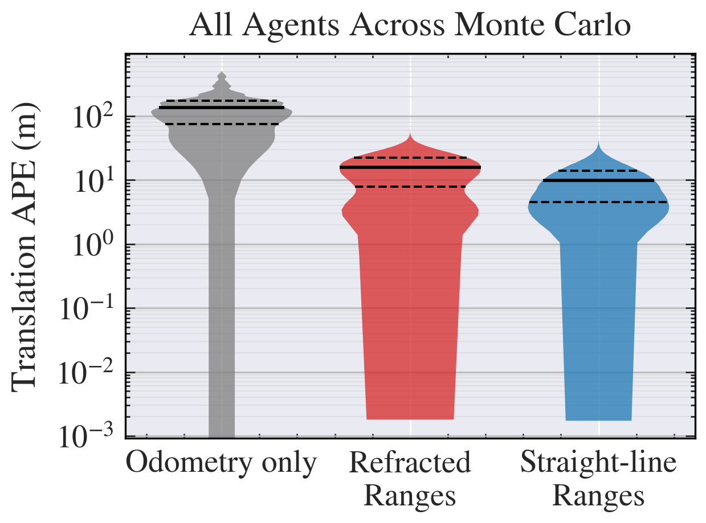
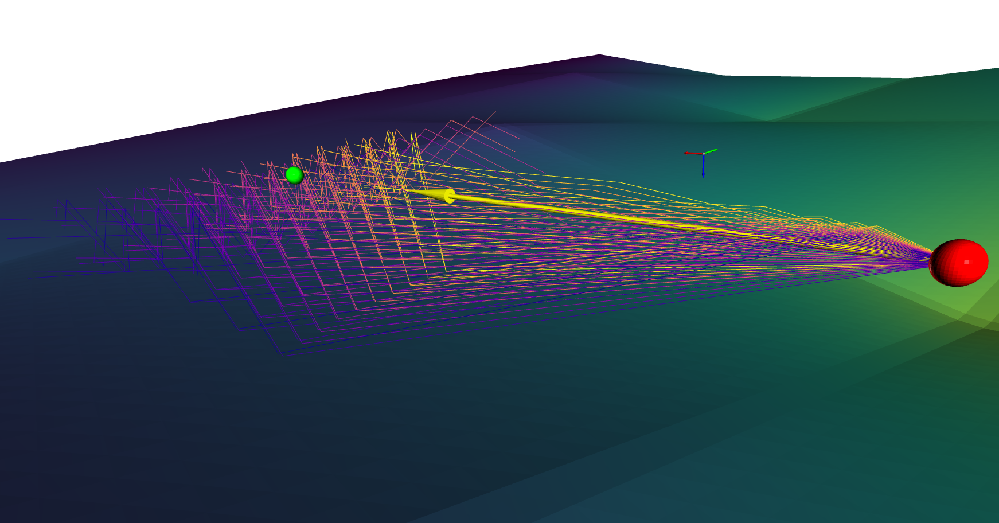

# MantaRay

*Characterizing Refraction-Induced Ranging Bias in Underwater Collaborative Localization*

[Timothy Kogucki](mailto:tkogucki4@gmail.com)<sup>1</sup>,
[Alan Papalia](mailto:apapalia@umich.edu)<sup>2</sup>

<sup>1</sup>KTH Royal Institute of Technology &nbsp;·&nbsp;
<sup>2</sup>[Robot Exploration Lab, University of Michigan](https://robotexploration.engin.umich.edu/)

[Paper (arXiv / OCEANS 2025 Monterey)](https://arxiv.org/abs/2609.18073) &nbsp;·&nbsp;
[Master's thesis (KTH)](https://urn.kb.se/resolve?urn=urn:nbn:se:kth:diva-387283) &nbsp;·&nbsp;
[Documentation](https://umich-robotexploration.github.io/manta-ray/) &nbsp;·&nbsp;
[Issues](https://github.com/UMich-RobotExploration/manta-ray/issues)

<p align="center">
  
</p>

Standard multi-agent acoustic SLAM pipelines assume straight-line
propagation for algorithmic tractability, but sound-speed variability
bends acoustic rays and systematically biases inter-agent ranges. Prior
work has not characterized this bias for kilometer-scale collaborative
fleets. This work does. **MantaRay** is the open-source simulator
behind that characterization: it ingests HYCOM reanalysis products,
uses GPU-accelerated Bellhop (`bellhopcuda`) ray tracing to generate
refraction-informed ranges between a fleet of Argo-style floats, and
feeds them into a centralized GTSAM factor graph. Simulated experiments
over the Beaufort Sea (cold-cap halocline) and Fram Strait
(Atlantic-polar exchange) with eleven floats over seven days and 25
Monte Carlo realizations quantify how acoustic refraction biases
estimators as fleets scale to operational domains spanning 5 to 12 km,
degrading trajectories and, through acoustic shadow zones, reducing the
number of available ranging measurements. MantaRay is released so
future environmentally-informed estimators can be evaluated against the
bias it exposes.

## Key findings

- **Variance is grossly under-modelled.** Empirical range-error spread
  reaches ±100 m (best-fit Gaussian σ = **35.7 m** Beaufort, **22.6 m**
  Fram), which is 20 to 35 times the σ<sub>r</sub> = 1 m Gaussian noise
  the estimator assumes.
- **Environment gates ranging availability.** Ranging failure rate is
  **1.0%** in Beaufort vs **6.8%** in Fram Strait; station-keeping
  float-to-diver links fail **3.6%** vs **29.5%**, an 8x regional
  difference under identical fleet and schedule.
- **Distribution shape is a regional fingerprint.** The Beaufort Sea
  carries a heavier negative tail; the Fram Strait is more symmetric.

## Repository layout

Two coupled subprojects sharing one git repo. Each has its own README.

| Subproject | Language | Role |
|---|---|---|
| [`mantaray/`](mantaray/README.md) | C++20 + CUDA | Rigid-body simulator, `bellhopcuda` ray tracing, factor-graph emission |
| [`pymantaray/acoustics/`](pymantaray/acoustics/README.md) | Python 3.12 | Pulls HYCOM data via oceanbench, writes `.npy` grids consumed by C++ |
| [`pymantaray/localization/`](pymantaray/localization/README.md) | Python 3.11 | Reads C++ `.pfg` output, runs GTSAM, plots APE via evo |

> [!IMPORTANT]
> The two Python subprojects are **independent** `uv`-managed projects
> on different Python versions and do NOT share an environment.
> Run `uv sync` from inside each subdir before using it.

## Data flow


## Quickstart

End-to-end pipeline in four stages. Each stage assumes its predecessor
has produced the artifacts it consumes.

```bash
# 1. Pull ocean data and write .npy grids  (Python 3.12)
cd pymantaray/acoustics && uv sync && uv run python oceanbench_data.py

# 2. Build the C++ simulator                (Release + CUDA)
cd ../../mantaray && cmake -S . -B cmake-build-release -DCMAKE_BUILD_TYPE=Release -G Ninja
cmake --build cmake-build-release

# 3. Run a scenario                         (must be inside cmake-build-release/src/)
cd cmake-build-release/src && ./mantaray_core ../../sim_config/beaufort_fleet_week_sim.json

# 4. Solve the resulting factor graph       (Python 3.11)
cd ../../../pymantaray/localization && uv sync && uv run python run_solver.py
```

Full build details, config schema, and per-stage usage live in the
subproject READMEs linked above.

## Reference factor graphs

The two Monte Carlo scenarios reported in the paper ship as prebuilt
`.pfg` files:
[`mantaray/results/arctic/beaufort-fleet-week/output.pfg`](mantaray/results/arctic/beaufort-fleet-week/output.pfg)
(Beaufort Sea, cold-cap halocline) and
[`mantaray/results/arctic/fram-strait-fleet-week/output.pfg`](mantaray/results/arctic/fram-strait-fleet-week/output.pfg)
(Fram Strait, Atlantic-polar exchange). `pymantaray/localization/run_solver.py`
and the Monte Carlo runner default to the Beaufort file, so a fresh
clone reproduces the paper's headline solve with no path edits:

```bash
cd pymantaray/localization && uv sync && uv run python run_solver.py
```

Switching to Fram Strait is a one-line change to `FILE_PATH`. Shipping
the factor graphs decouples estimator experimentation from the CUDA
build: a reader iterating on noise models, robust kernels, or graph
pre-processing exercises the same inputs that produced the paper's
numbers, without provisioning a GPU or compiling `bellhopcuda`. The
C++ pipeline remains authoritative for regenerating factor graphs
under new configurations; the shipped pair is not a replacement but a
fixed reference against which downstream estimator changes stay
comparable.

## Example results

Selected figures from the paper's simulated experiments, split by
oceanographic environment. Both regions share the same fleet layout,
ping schedule, and Monte Carlo protocol; only the underlying
sound-speed structure differs.

<table>
  <tr>
    <th align="center">Beaufort Sea (cold-cap halocline)</th>
    <th align="center">Fram Strait (Atlantic-polar exchange)</th>
  </tr>
  <tr>
    <td align="center">
      <br/>
      <sub>Fleet-wide signed range error <code>r_refracted − r_straight-line</code>; empirical σ = 35.7 m against a σ<sub>r</sub> = 1 m Gaussian assumption.</sub>
    </td>
    <td align="center">
      <br/>
      <sub>Same channel, Fram Strait; empirical σ = 22.6 m and a sharper central peak than any Gaussian at that σ can reproduce.</sub>
    </td>
  </tr>
  <tr>
    <td align="center">
      <br/>
      <sub>Pooled translation APE across 11 divers × 25 Monte Carlo seeds; refracted ranges add ~1.65× median APE over the straight-line ideal.</sub>
    </td>
    <td align="center">
      <br/>
      <sub>Same APE distributions in Fram Strait; variance mismatch dominates fleet-level trajectory error.</sub>
    </td>
  </tr>
</table>

The bias figures above collapse whole distributions into single numbers,
but the underlying geometry is what MantaRay actually produces. The
one-off render below visualizes ray paths for a single acoustic link
through the Beaufort SSP. Rays leave the source, bend under the
sound-speed gradient, and reach the receiver along curved arcs rather
than a straight line. This curvature is the geometric root of the range
error the paper characterizes. The render itself is not part of the
standard pipeline; it was built in Open3D from a `bellhopcuda` ray trace
and can be reproduced the same way.

<p align="center">
  
</p>

The full figure set (SSP profiles, fleet layout, factor-graph 3D view)
lives under [`docs/figures/`](docs/figures).

## Citation

If MantaRay contributes to your work, please cite the accompanying
paper, presented at **OCEANS 2025 Monterey**. The BibTeX entry below
points to the arXiv preprint and will be updated with the final IEEE
page numbers and DOI once the conference proceedings are published.

```bibtex
@misc{kogucki2026characterizingrefractioninducedrangingbias,
      title={Characterizing Refraction-Induced Ranging Bias in Underwater Collaborative Localization},
      author={Timothy Kogucki and Alan Papalia},
      year={2026},
      eprint={2609.18073},
      archivePrefix={arXiv},
      primaryClass={cs.RO},
      url={https://arxiv.org/abs/2609.18073},
}
```

The GitHub "Cite this repository" button is populated from
[CITATION.cff](CITATION.cff).

For a deeper treatment of the methodology, environmental modeling
choices, and additional experiments beyond what the paper covers, see
the accompanying master's thesis:

> Kogucki, T. *Characterizing Refraction-Induced Ranging Bias in
> Underwater Collaborative Localization.* Master's thesis, KTH Royal
> Institute of Technology, 2026.
> [urn:nbn:se:kth:diva-387283](https://urn.kb.se/resolve?urn=urn:nbn:se:kth:diva-387283)

## Acknowledgements

MantaRay depends on and gratefully credits:

- **HYCOM GLBv0.08** reanalysis product for the ocean environmental
  fields
- **BELLHOP** (Porter) and **bellhopcuda / bellhopcxx** (Pisha et al.) for
  ray-traced acoustic propagation
- **GTSAM** (Dellaert et al.) for the factor-graph backend
- **evo** (Grupp) for absolute pose-error evaluation
- **SciencePlots** for IEEE-quality matplotlib styling

## License

Distributed under the [MIT License](LICENSE).
