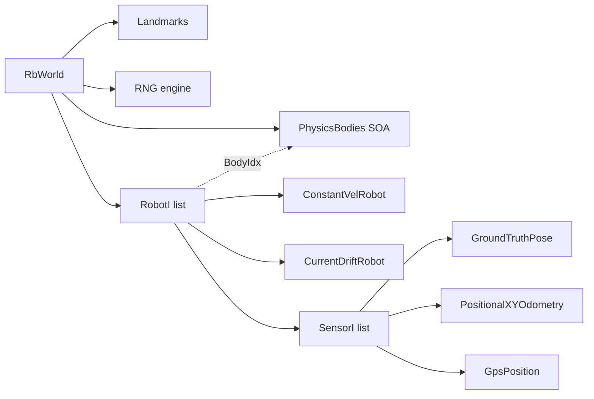

# Rigid Body Library

Sub library that handles the rigid body aspects of the manta-ray simulation.
It provides a simple physics world with forward-Euler integration, a robot
abstraction with pluggable sensors, and ground-truth state tracking.

## Composition

`RbWorld` is the top-level container. It owns the SOA physics storage,
the robot list, landmarks, and a shared RNG. Each `RobotI` references a
body in `PhysicsBodies` (by `BodyIdx`) and owns a list of `SensorI` that
sample at their own configured rates during `advanceWorld()`.

## Key Classes

- **RbWorld** — Top-level simulation container. Owns the dynamics bodies,
  robots, landmarks, and a shared RNG engine. `advanceWorld(targetTime)`
  steps physics and samples all sensors up to the requested time.

- **PhysicsBodies** — Flat SOA storage for position, velocity, and
  acceleration of all dynamic bodies. Indexed by `BodyIdx`.

- **Integrator** — Forward-Euler integrator that advances body state by `dt`.

- **RobotI** — Abstract robot interface. Each robot owns a `BodyIdx` into
  `PhysicsBodies` and a list of sensors. Subclasses implement `update()` to
  apply forces or set velocities each timestep.

- **SensorI** — Abstract sensor interface. Sensors are sampled at a
  configurable rate and accumulate timestamped data vectors. Built-in types
  include `GroundTruthPose`, `PositionalXYOdometry`, and `GpsPosition`.

- **ConstantVelRobot** — Simple robot that maintains a constant velocity.
  Configured via `ConstantVelConfig`.
