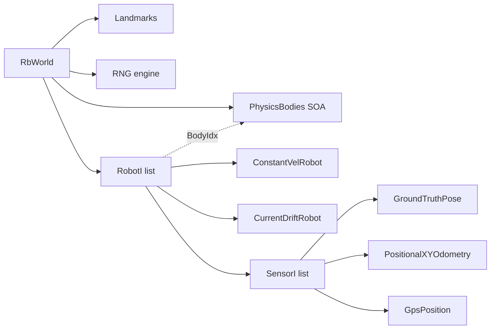

# Rigid Body Library

Sub library that handles the rigid body aspects of the manta-ray simulation.
It provides a simple physics world with forward-Euler integration, a robot
abstraction with pluggable sensors, and ground-truth state tracking.

## Composition

`RbWorld` is the top-level container. It owns the SOA physics storage,
the robot list, landmarks, and a shared RNG. Each `RobotI` references a
body in `PhysicsBodies` (by `BodyIdx`) and owns a list of `SensorI` that
sample at their own configured rates during `advanceWorld()`.

```mermaid
flowchart LR
  World[RbWorld] --> PB[PhysicsBodies SOA]
  World --> Landmarks[Landmarks]
  World --> RNG[RNG engine]
  World --> Robots[RobotI list]
  Robots --> CV[ConstantVelRobot]
  Robots --> CD[CurrentDriftRobot]
  Robots --> Sensors[SensorI list]
  Sensors --> GT[GroundTruthPose]
  Sensors --> Odom[PositionalXYOdometry]
  Sensors --> GPS[GpsPosition]
  Robots -. BodyIdx .-> PB
```

## Key Classes

- **RbWorld** — Top-level simulation container. Owns the dynamics bodies,
  robots, landmarks, and a shared RNG engine. `advanceWorld(targetTime)`
  steps physics and samples all sensors up to the requested time.

- **PhysicsBodies** — Flat SOA storage for position, velocity, and
  acceleration of all dynamic bodies. Indexed by `BodyIdx`.

- **Integrator** — Forward-Euler integrator that advances body state by `dt`.

- **RobotI** — Abstract robot interface. Each robot owns a `BodyIdx` into
  `PhysicsBodies` and a list of sensors. Subclasses implement
  `computeLocalTwist()` to return the body-frame twist applied at each
  timestep. See [Robots](#robots) for the concrete subclasses.

- **SensorI** — Abstract sensor interface. Sensors are sampled at a
  configurable rate and accumulate timestamped data vectors. Built-in types
  include `GroundTruthPose`, `PositionalXYOdometry`, and `GpsPosition`.

## Robots

Two `RobotI` subclasses ship with MantaRay, selected per-agent in the
sim config's `"robots"` array via the `type` field.

| Type key | Class | Header | Summary |
|---|---|---|---|
| `constant_vel` | `rb::ConstantVelRobot` | [`RobotsAndSensors.h`](include/rb/RobotsAndSensors.h) | Prescribes a fixed body-frame linear velocity; use with `velocity: [0, 0, 0]` as a station-holding beacon. |
| `current_drift` | `robots::CurrentDriftRobot` | [`CurrentDriftRobot.h`](../include/mantaray/sim/CurrentDriftRobot.h) | Argo-style diver: four-phase vertical cycle (descend / hold-depth / ascend / hold-surface) with a P controller on depth; horizontal motion inherited from the ocean current field. |

`CurrentDriftRobot` lives under `sim/` rather than `rb/` because it
depends on an `acoustics::GridVec` to sample currents, but still
implements the `rb::RobotI` interface. See each header for its full
config struct and behavior.
