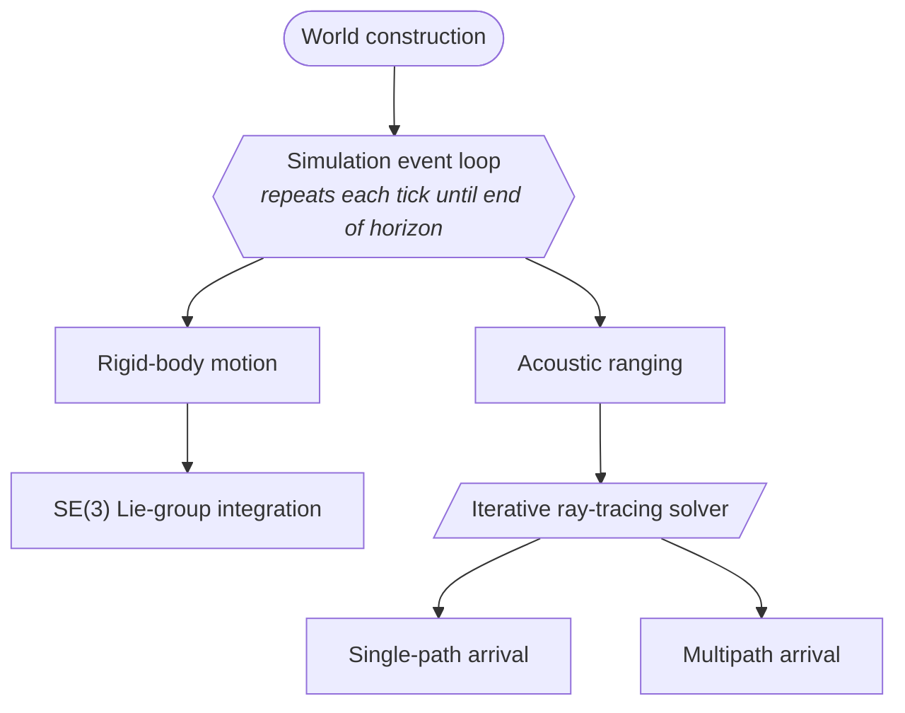
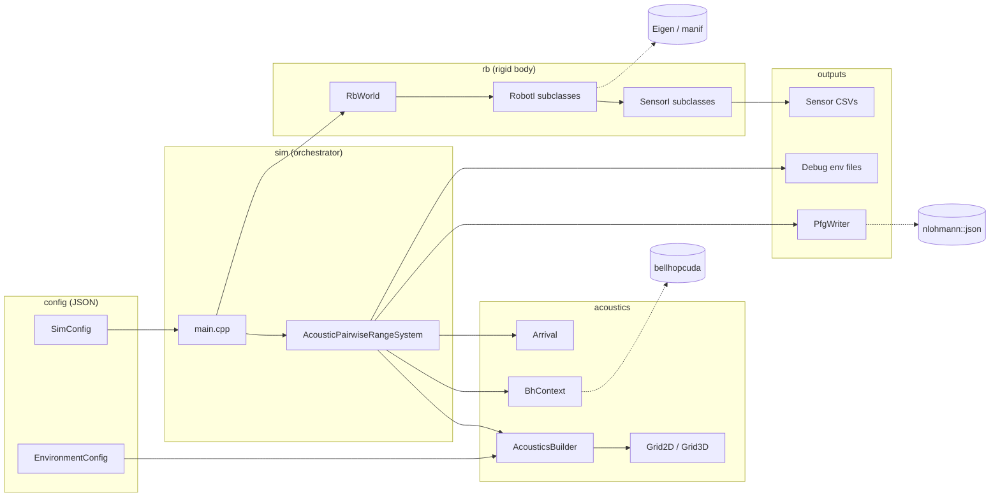
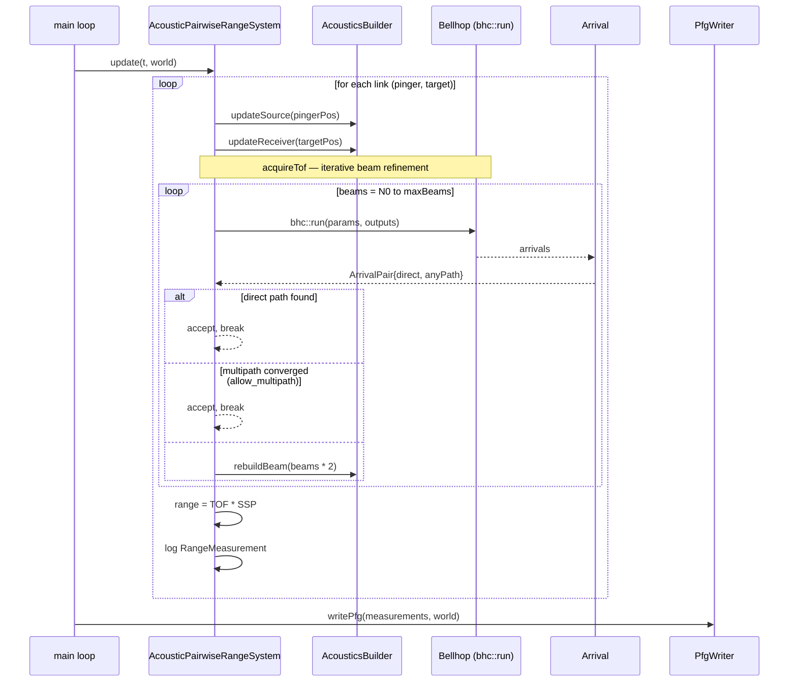

# Simulation

This package contains the top-level simulation loop, robot factories, and
acoustic ranging systems that tie together the rigid body and acoustics
libraries.

## Overview {#overview}

The Manta Ray benchmarking environment operates as an event-based simulation
with two primary events: advancing rigid-body motion and acquiring
acoustic-range measurements. These two functionalities are split across two
libraries that are combined into a single simulation executable. Acoustic
ranging is iterative and may resolve as either a single-path or multipath
arrival, handled separately.



## Architecture {#architecture}

### System Context

The simulator is organized into three internal libraries (`acoustics`, `rb`,
`sim`) plus a configuration layer and an output layer. The `sim` package is
the orchestrator: it owns `main.cpp` and `AcousticPairwiseRangeSystem`, which
together drive the rigid-body world and the acoustic ray tracer to produce
range measurements and a factor-graph file for downstream SLAM backends.



Solid arrows are direct dependencies (composition or function calls); dashed
arrows are external library boundaries.

### Ping Lifecycle

A single range measurement traverses the orchestrator, the acoustics stack,
and (after all pings for the timestep are collected) the output writer. The
inner loop is the iterative beam refinement described in the next section.



## Iterative Beam Refinement {#iterative_beam_refinement}

### Problem

Bellhop ray tracing discretizes the angular space into a finite beam fan. With
too few beams, the direct path between source and receiver can fall between
rays, causing the system to either miss the arrival entirely or return only
multipath (bounced) arrivals. Multipath arrivals travel longer paths and
produce different ranging results. The simulation will be expanded to account for this.

### Solution

The `AcousticPairwiseRangeSystem::acquireTof()` method implements an iterative
solver that progressively increases beam density until a direct-path arrival
(zero surface and bottom bounces) is found.

### Algorithm

```
originalBeams = builder.getNumBeams()     // e.g. 80
maxBeams      = builder.getMaxBeams()     // e.g. 300
beams         = originalBeams

while beams <= maxBeams:
    run bellhop with current beam count
    check arrivals for direct path (NTopBnc == 0 && NBotBnc == 0)

    if direct path found:
        return TOF → done

    nextBeams = beams * kBeamIterativeFactor
    nextBeams = min(nextBeams, maxBeams)   // clamp so final step hits max

    if beams >= maxBeams:
        log failure → done (no direct path at max resolution)

    rebuild beam fan at nextBeams
    beams = nextBeams

restore beam count to originalBeams
```

### Key Properties

- **Clamping**: The final iteration always runs at `maxBeams`, even when it is
  not a clean multiple of the scale factor. This guarantees the full allocated
  resolution is used before giving up.

- **Pre-allocation**: `AcousticsBuilder` allocates ray arrays for `maxBeams`
  on the first call to `constructBeam()`. Subsequent calls to `rebuildBeam()`
  reuse the allocation by only updating the active beam count (`alpha.n`,
  `beta.n`) and refilling the angle arrays. This avoids bellhop memory budget
  errors from mid-simulation reallocation.

- **Restoration**: After the loop completes (whether a direct path was found
  or not), the beam count is restored to `originalBeams` so subsequent links
  are not affected.

- **Reciprocal caching**: Robot-robot links use a TOF cache keyed by unordered
  pair index. The iterative solver runs once per unique pair; the reverse
  direction reuses the cached result.

### Configuration

All parameters are set in the `"acoustics"` block of the sim config JSON:

| Key                | Type   | Default | Description                                      |
|--------------------|--------|---------|--------------------------------------------------|
| `num_beams`        | int    | 80      | Initial beam count per axis                      |
| `max_beams`        | int    | 180     | Maximum beam count for iterative refinement      |
| `beam_spread_deg`  | double | 20.0    | Half-cone angle of the beam fan in degrees       |

The scale factor `kBeamIterativeFactor` is a compile-time constant on
`AcousticPairwiseRangeSystem` (default 2.0).

### Example

With `num_beams=80`, `max_beams=300`, `kBeamIterativeFactor=2.0`:

| Step | Beams | Notes                               |
|------|-------|-------------------------------------|
| 1    | 80    | Initial attempt                     |
| 2    | 160   | 80 * 2.0                            |
| 3    | 300   | Clamped from 320, final attempt     |

With `num_beams=80`, `max_beams=180`, `kBeamIterativeFactor=2.0`:

| Step | Beams | Notes                               |
|------|-------|-------------------------------------|
| 1    | 80    | Initial attempt                     |
| 2    | 160   | 80 * 2.0                            |
| 3    | 180   | Clamped from 320, final attempt     |

### Related Classes

- `AcousticPairwiseRangeSystem` — owns the iteration loop and scale factor
- `AcousticsBuilder` — owns beam count, max beam count, and ray array allocation
- `Arrival::getFastestArrival(bool directPathOnly)` — filters arrivals by bounce count
