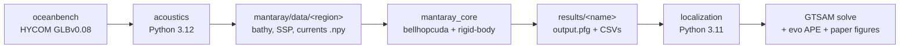

# pymantaray/ — Python tooling

Python side of MantaRay, split into two independent `uv`-managed
subprojects — one per stage of the pipeline. They live in the same
directory but do NOT share an environment; they are pinned to
different Python versions.

| Subproject | Python | Role |
|---|---|---|
| [`acoustics/`](acoustics/README.md) | 3.12 | Pulls HYCOM ocean data via oceanbench, writes `.npy` grids consumed by the C++ simulator |
| [`localization/`](localization/README.md) | 3.11 | Reads C++ `.pfg` output, builds a GTSAM factor graph, reports APE via evo |

> [!WARNING]
> Each subproject is its own `uv` project with its own lockfile and its
> own Python interpreter. Run `uv sync` from **inside each subdir**
> before using it. Do not try to install both into a single venv.

## Data flow

The full end-to-end pipeline (including the C++ build step) is
documented in the [root README](../README.md#quickstart).

## Convention: no CLI

Every script in both subprojects is intentionally not CLI-driven.
Region, file-path, and Monte-Carlo constants live at the top of each
file — edit them, then re-run. This keeps the scripts self-documenting
and avoids the overhead of argparse for what are effectively project-
specific driver notebooks.
